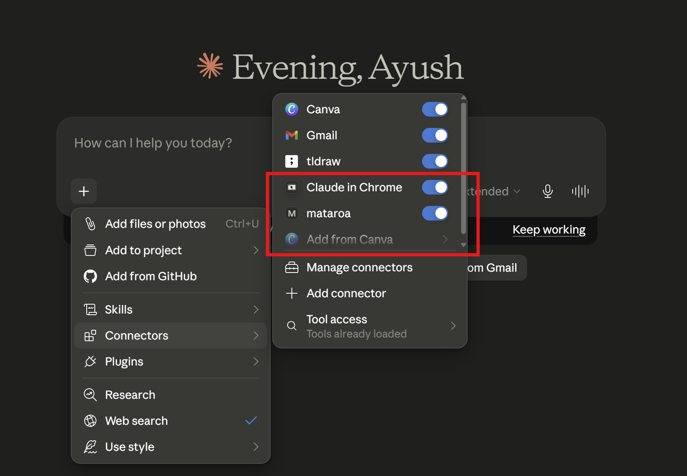

# mataroa-mcp

An MCP server that lets you manage your [Mataroa](https://mataroa.blog) blog through natural language in Claude Desktop, Claude Code, or any MCP-compatible AI client.

---

## What you can do

Tell Claude things like:

- *"Show me all my blog posts"*
- *"Write a post about my weekend hike and save it as a draft"*
- *"Publish my sourdough post"*
- *"Are there any comments waiting for approval?"*
- *"Delete the draft called testing-123"*
- *"Create an About page for my blog"*

Claude will call the right tool automatically.

---

## Preview



---
Demo conversation [link](https://claude.ai/share/056a508f-57c0-4170-92c6-bc77ec77fe2a) 
## Setup (5 minutes)

### 1. Get your Mataroa API key

1. Go to [mataroa.blog](https://mataroa.blog) and log in (or create a free account).
2. Open **Dashboard → API** and copy your API key.

### 2. Install the server

You need Python 3.10 or later. Clone this repo and install it locally:

```bash
git clone https://github.com/ayush111111/matoroa-mcp.git
cd matoroa-mcp
pip install -e .
```

### 3. Add to Claude Desktop

Open your Claude Desktop config file:

- **macOS:** `~/Library/Application Support/Claude/claude_desktop_config.json`
- **Windows:** `%APPDATA%\Claude\claude_desktop_config.json`

If there is no `"mcpServers"` key, add it at the top level alongside any existing keys:

```json
{
  "mcpServers": {
    "mataroa": {
      "command": "/path/to/.venv/bin/python",
      "args": ["-m", "mataroa_mcp.server"],
      "env": {
        "MATAROA_API_KEY": "paste-your-key-here"
      }
    }
  },
  "...your other existing config keys...": "..."
}
```

**Replace `/path/to/.venv/bin/python` with your actual virtual environment path.**

On **Windows**, this would be:
```json
"command": "C:\\Users\\your-username\\path\\to\\matoroa-mcp\\.venv\\Scripts\\python.exe"
```

On **macOS/Linux**, this would be:
```json
"command": "/Users/your-username/path/to/matoroa-mcp/.venv/bin/python"
```

> **Note:** Claude Desktop needs the absolute path to the Python executable to launch the server reliably. Using just `"python"` may not work. Once `mataroa-mcp` is published to PyPI, you can use `"command": "uvx", "args": ["mataroa-mcp"]` instead.

### 4. Restart Claude Desktop

Quit and reopen Claude Desktop. You should see a small plug icon in the chat bar indicating MCP tools are active.

### 5. Test it

Type: *"Show me my blog posts"* — Claude should list them.

---

## Add to Claude Code

Create or edit `.mcp.json` in your project root:

```json
{
  "mcpServers": {
    "mataroa": {
      "command": "/path/to/.venv/bin/python",
      "args": ["-m", "mataroa_mcp.server"],
      "env": {
        "MATAROA_API_KEY": "paste-your-key-here"
      }
    }
  }
}
```

Replace `/path/to/.venv/bin/python` with the absolute path to your virtual environment's Python executable (same as Claude Desktop setup).

---

## Available tools

| Tool | What it does |
|------|-------------|
| `list_posts` | List all posts (published + drafts) |
| `list_drafts` | List only unpublished drafts |
| `get_post` | Get a single post by slug |
| `create_post` | Create a new post |
| `update_post` | Edit an existing post |
| `delete_post` | Permanently delete a post |
| `publish_post` | Publish a draft (sets today's date, or a date you choose) |
| `unpublish_post` | Revert a published post back to draft |
| `list_comments` | List all comments (or just for one post) |
| `list_pending_comments` | List comments awaiting moderation |
| `approve_comment` | Approve a pending comment |
| `delete_comment` | Delete a comment |
| `list_pages` | List all pages |
| `get_page` | Get a single page by slug |
| `create_page` | Create a new page |
| `update_page` | Edit an existing page |
| `delete_page` | Permanently delete a page |

---

## Notes

- **API key is never stored in code** — it's always read from the `MATAROA_API_KEY` environment variable.
- **Mataroa has no rate limiting**, so you can make requests freely.
- **Blog-level settings** (title, custom domain, etc.) are not accessible via the Mataroa API and therefore not exposed here.
- Draft posts have `published_at: null`. Publishing sets it to a date; unpublishing clears it.

---

## Running tests

```bash
# Install test dependencies
pip install -e .
pip install pytest pytest-asyncio respx

# Unit tests (no API key needed)
python -m pytest tests/test_client.py tests/test_server.py -v

# Integration tests (requires a real Mataroa API key)
$env:MATAROA_API_KEY="your-key"; python -m pytest tests/test_integration.py --run-integration -v
```

## Running the server locally

To test the server outside of Claude Desktop, use stdio transport (default):

```bash
# Set your API key and run the server (stdio transport for MCP clients)
$env:MATAROA_API_KEY="your-key"; python -m mataroa_mcp.server
```

The server communicates via stdio by default, which is the standard MCP transport.

**For HTTP testing (advanced):** To test with HTTP endpoints, modify the `main()` function in `server.py` to use:
```python
mcp.run(transport="sse")  # or "streamable-http"
```
Then the server will listen on `http://127.0.0.1:8000`.

---

## Troubleshooting

### "Could not attach MCP server mataroa" in Claude Desktop

**Causes:**
- Using just `"python"` in the config (needs absolute path to venv)
- Old Python bytecode cached in `.venv/Lib/site-packages/mataroa_mcp/__pycache__`
- Port 8000 already in use from a previous server instance

**Solutions:**
1. Use the **absolute path** to your virtual environment's Python executable (see Claude Desktop setup above)
2. Clear the cache: `Remove-Item -Recurse -Force ".venv/Lib/site-packages/mataroa_mcp/__pycache__"`
3. Make sure no other process is using port 8000: `netstat -ano | findstr :8000`
4. Restart Claude Desktop after making changes to `claude_desktop_config.json`

### Tests fail with "async def functions are not natively supported"

This happens if `pytest-asyncio` isn't installed properly. Run:
```bash
pip install pytest-asyncio
```

Then restart your Python environment or terminal.

---

## License

MIT
